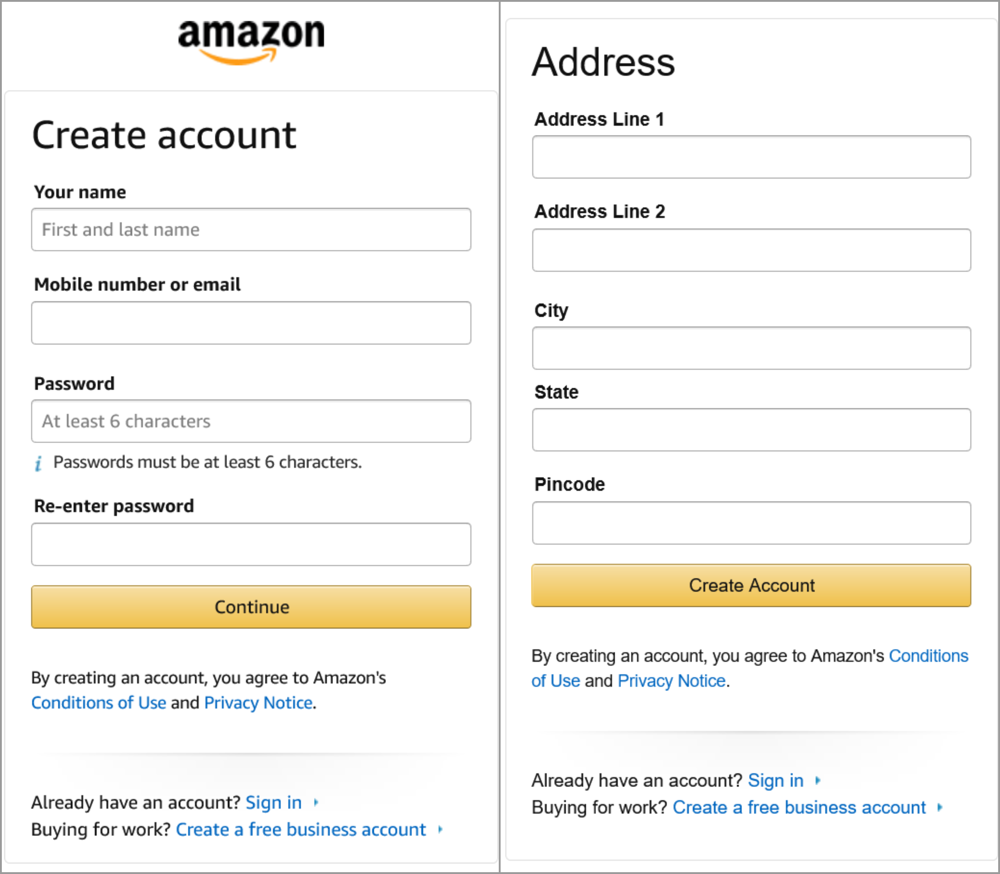
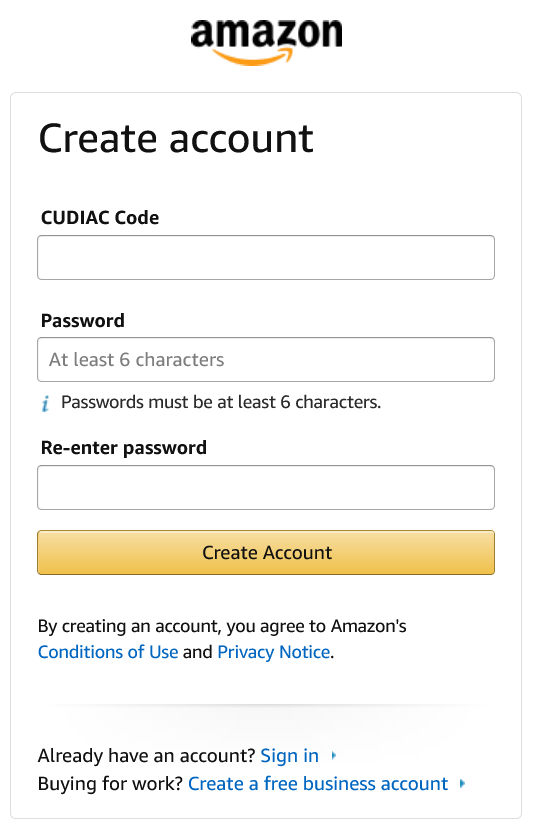

<h1 align="center"><a href="http://cudiac.co/">CUDIAC</a></h1>
<h3 align="center">CONSOLIDATED USER DETAILS IN A CODE</h3>

Streamlining the process of updating your details on multiple services by linking your details to a unique code

 

## Problem Statement:
- Manual entry of User details (Name, address, mobile, e-mail) are required to be entered on different sites repetitively, with each detail being filled separately.
- If any detail about the user is changed, commonly their address, they need to visit each of these services (Amazon, Flipkart, Zomato) and change their details on each service/site repetitively & redundantly. 
## Our Solution:
- In order to end users’ repetitive need to update their details on each platform, a unique code mapped to each user’s details is generated.
- This unique code stores the user details on a secure database, and is shared with the platform upon user authorization

<h3>Before:</h3>
</img>
<h3>After:</h3>
</img>

## Future Scope:
- Since the user data can be accessed from the unique code, the user will also have the right to remove the information access from any platform they seem fit and grant the access back within a time period
- Each user will be able to store upto 5 profiles, each with their own details and a unique code. 
- This will be similar to Aadhar authentication, but for most common user details, all centralized in one place.
- Stay tuned for for more feature updates!
